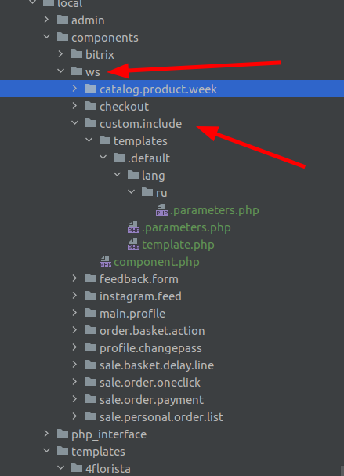
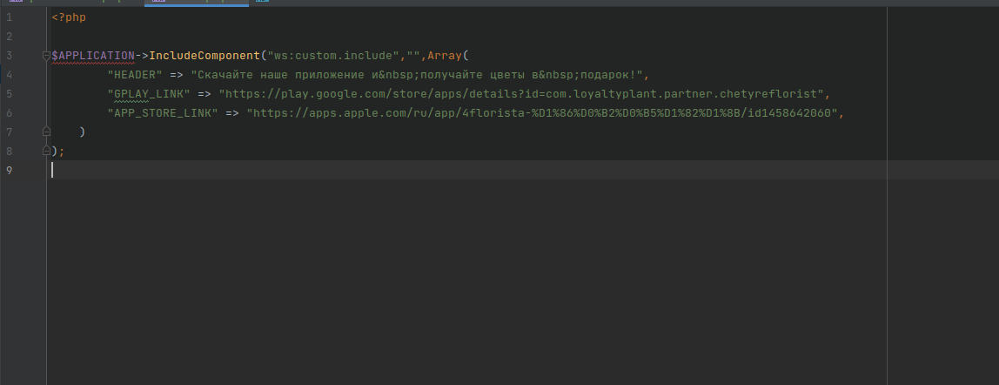
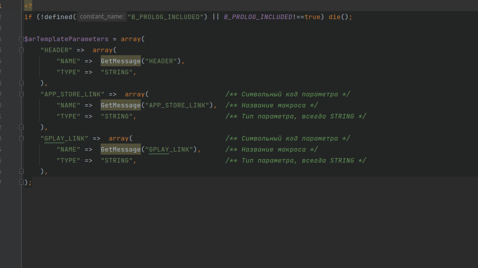
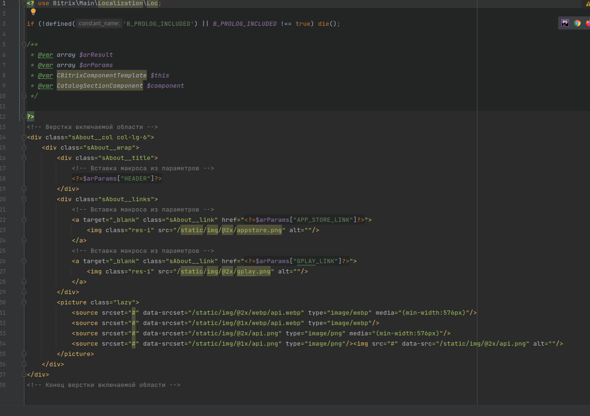
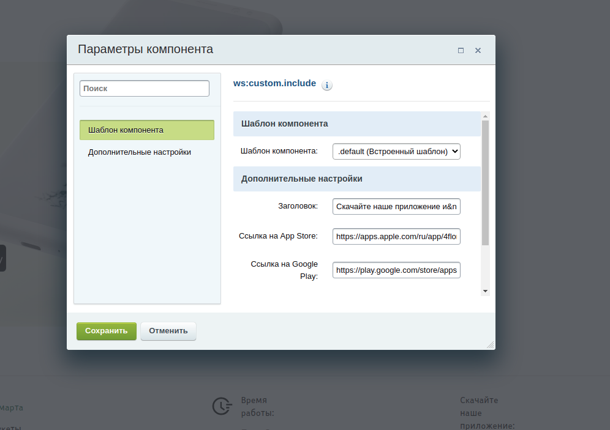

# Кастомная включаемая область

Данное решение является настраиваемым компонентом кастомной включаемой области, предназначенное для минимизации риска повредить верстку при редактировании из Эрмитажа
## Размещение файлов ##
Папку **_custom.include_** необходимо разместить в нэймспейсе **ws**

В файле **_index.php_** представлен пример вызова компонента

## Настройка макросов ##
В данном решении макросы реализованы при помощи параметров компонента.
Для того, чтобы их настроить, необходимо создать новый шаблон комопнента и в файле **_.parameters.php_**
прописать все необходимые макросы в виде параметров типа "строка"

Далее необходимо в файле template.php шаболона разместить верстку включаемой области, а после расставить вывод параметров, как в примере

## Визуальный редактор ##
Если все настройки были произведены корректно, то в режиме правки можно настраивать заменяемые значения включаемой области (макросы) следующим образом

## Заключение ##
Это решение идеально подойдет, если структура верстки включаемой области не будет меняться, а изменение конкретных данных через Эрмитаж представляет угрозу целостности страницы